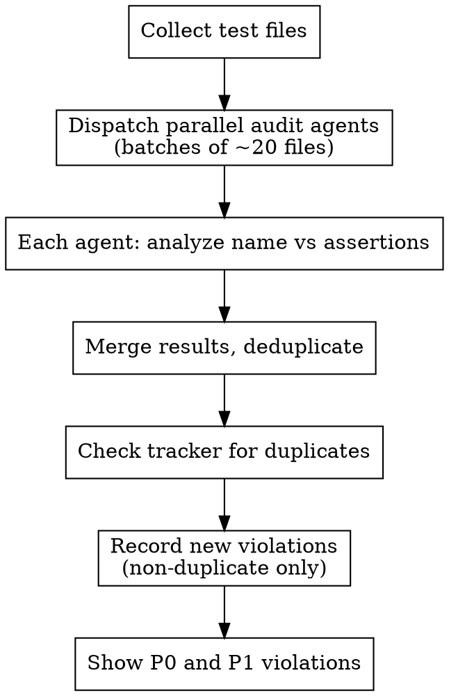

# Audit Test Assertions

Scan unit and integration tests, verify assertions match what each test name claims to test, record violations, and surface the most urgent ones.

## Process



## Step 1: Collect Test Files

```bash
# All test files (unit + integration)
find tests/unit tests/integration -name 'test_*.py' -not -name '__init__.py'
```

Exclude `__init__.py`, `conftest.py`, and solution files (e.g., `exercises/*/solutions/`).

## Step 2: Dispatch Parallel Audit Agents

Split files into batches of ~20. Dispatch one subagent per batch. Each subagent receives:

**Prompt template for each audit subagent:**

> You are auditing test files for assertion-vs-name mismatches.
>
> For each test function in the files below, check whether the test's ASSERTIONS actually verify what the test NAME claims to test.
>
> **Priority Classification:**
> - **P0**: Test name is actively misleading — asserts the opposite of what name says, or asserts something completely unrelated
> - **P1**: Test name claims a specific behavior but assertions don't verify it (e.g., name says "preserves_order" but test only checks length; name says "raises_error" but no `pytest.raises`)
> - **P2**: Test name is slightly aspirational — assertions are in the right area but don't fully verify the claim (e.g., name says "accumulates_correctly" but only checks step count, not accumulated value)
>
> **What is NOT a violation:**
> - Test name says "terminates" and test checks step count < N — that IS testing termination
> - Test name says "does_not_crash" and test just runs without error — that IS testing crash-freedom
> - Test name is generic (e.g., "test_basic_execution") and assertions are generic — no mismatch
> - Smoke tests named as smoke tests
>
> **Output format** (one line per violation, skip clean tests):
> ```
> FILE | TEST_NAME | CLAIMS | ACTUALLY_CHECKS | PRIORITY
> ```
>
> Files to audit:
> [list of ~20 file paths]

## Step 3: Merge and Deduplicate Results

Combine all subagent results. Remove duplicate findings (same file + test name reported by overlapping agents). Sort by priority (P0 first).

## Step 4: Check for Already-Tracked Violations

Before recording anything, search whatever issue tracker the project uses for open
items covering the same test. Search on the test name and on terms like "assertion
mismatch". Skip any violation that already has an open issue.

If the project has no tracker, skip to Step 6 and report the findings directly.

## Step 5: Record New Violations

For each violation not already tracked, record one item with:

- **Title:** `Test assertion mismatch: <test_name> in <file>`
- **Priority:** P0, P1 or P2 as classified above
- **Type:** bug
- **Label:** `audit-asserts`, so a later sweep can find them
- **Body:** what the name claims, what the assertions actually check, and `<path>:<line>`

Use the project's own tracker CLI or API. After a bulk creation, re-check for
near-duplicates — batches dispatched in parallel often report the same test twice
under slightly different wording.

## Step 6: Show Urgent Violations

Display the open P0 and P1 items as a summary table: file, test name, what's wrong,
priority.

## Quick Reference

| Priority | Meaning | Action |
|----------|---------|--------|
| P0 | Actively misleading | Fix immediately |
| P1 | Claims unverified behavior | Fix soon — test gives false confidence |
| P2 | Slightly aspirational | Fix when touching that file |

## Common Mistakes

**Over-flagging smoke tests.** A test named `test_basic_execution` that just runs code without crashing is fine — the name doesn't claim specific behaviour.

**Ignoring module-level documentation.** If the module's header comment says "tests verify X and Y" but the individual tests only verify X, that's a P2 at the module level, not per-test.

**Asserting on one field of a compound result.** When the result has several parts and the test name claims something about a specific part, check that the assertions actually reach that part. A test named for type preservation that asserts only on the value and never on the type is a real P1 — it would pass with the type discarded.

**Missing ordering assertions on sequences.** When a test name implies a sequence or structure (e.g. "while_loop", "pipeline", "ordering"), check that the assertions verify the *order* of elements, not just their presence. Asserting that the collection is non-empty, or that some element is a member of it, says nothing about arrangement — the test would pass with the elements emitted in any order. Prefer assertions that pin relative positions. Missing ordering is P2 if the name merely implies structure, P1 if the name explicitly claims it.

**Creating duplicate issues.** Always search the tracker first. A prior sweep may already have logged most of what this one finds — a repeat audit that re-files everything buries the new findings.
